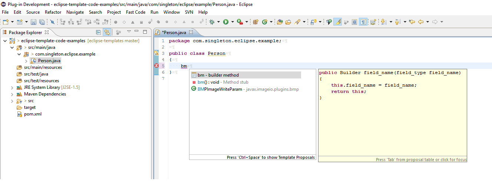
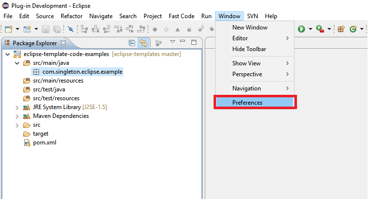
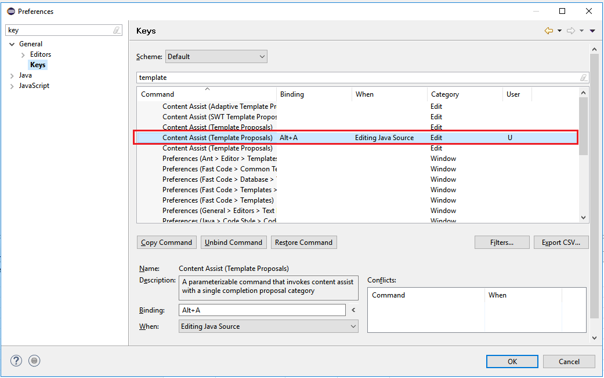
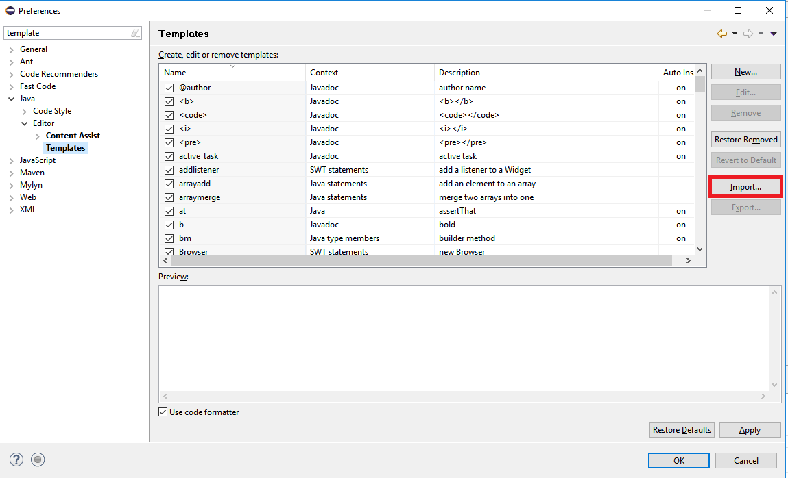

# Commonly Used Eclipse Templates
This repository will store the eclipse templates that I commonly use when coding java projects in eclipse.

## Settings
By default, to use a template, you have to push the ctrl + space shortcut and then at the least hit enter to select the 
first template that shows up.  If there are other suggestions that show up, it will additionally causes you to sift 
through additional entries to find what you're looking for.

To get around this, a key binding to automatically use templates only can be assigned.  This allows the user to type 
the keyword of the template, and hit the key binding to automatically expand the template without having to sift 
through menus. This can be accomplished through the following instructions:

* This can be accomplished by going to the preferences in eclipse:

* Go to the General > Keys screen in preferences and find an entry called 'Content Assist (Template Proposals)'.  You
might have to experiment with this since there are generally a few entries.  Assign a key binding of your choice, I
like to use 'alt + a'.

## Import Templates
To import templates:
* Go to the preferences:

* Go to templates for the java editor, and click import.  Find the file that you would like to import now.

# Templates
This repository is set up such that all templates are contained within the [all templates](templates/all-templates.xml) 
file. 

Additionally, you can import each of the individual templates located in the subfolders of the [templates](templates)
directory. 
