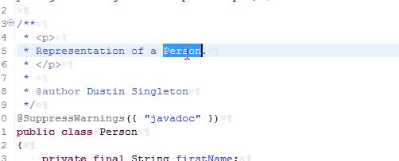
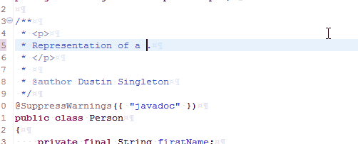

# b Template
In javadoc, surrounds the selected text in strong (bold tags). If no selected text, then just inserts the strong tags with ability to add text in between and then tab out.  'b' is short for 'bold'.

#### Keyword
```
b
```

#### Replacement Value
```
<strong>${word_selection}${info}</strong>${cursor}
```

#### Demos




