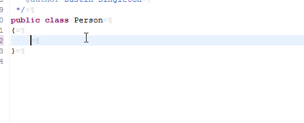

# pf Template
This is a template for creating a private final variables or classes. 'pf' is an abbreviation for 'private final'.

#### Keyword
```
pf
```

#### Replacement Value
```
private final ${cursor}
```

#### Demos


