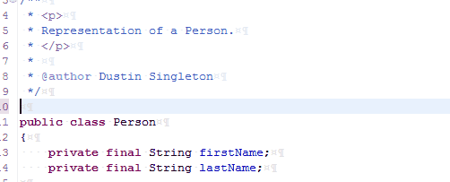

# sup Template
Template for suppressing warnings.  It defaults to javadoc, but additional can be added.  'sup' is an abbreviation for 'Suppress Warnings'.

#### Keyword
```
sup
```

#### Replacement Value
```
@SuppressWarnings({ "${javadoc}" })${cursor}
```

#### Demos


